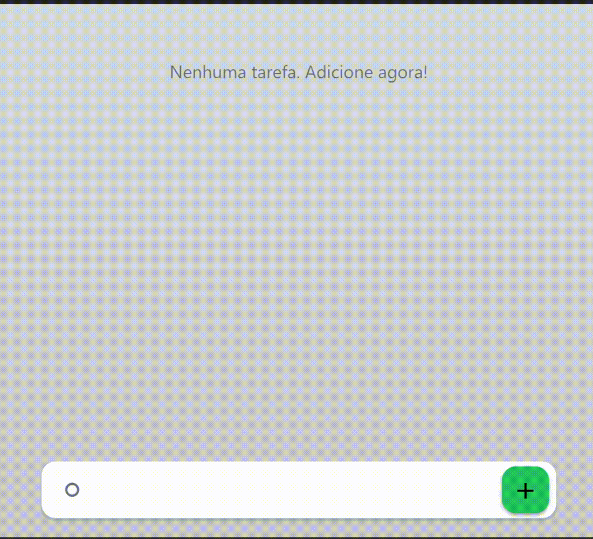

<h1 align="center">📋✔ Super ToDo App</h1>

<strong>Um simples aplicativo de tarefas para fins de aprendizado</strong>

------------

------------

Este projeto é baseado no aplicativo **Microsoft ToDo** e construido com **Next.js**.
Tem como proposito ser um objeto de estudos em todas as tecnologias envolvidas no projeto.
Sinta-se livre para explorar os arquivos e adicionar ou remover seus proprios recursos.

## 🌐 Tecnologias
- [TypeScript](https://www.typescriptlang.org/) Superset de JavaScript com tipagem estática.
- [ReactJS](https://reactjs.org/) Biblioteca JavaScript para construção de interfaces de usuário.
- [Next.js](https://nextjs.org/) Framework React para desenvolvimento web avançado.
- [React Testing Library](https://testing-library.com/docs/react-testing-library/intro/) # Tecnologias
- [TailwindCSS](https://tailwindcss.com/) Biblioteca para testes de componentes React.

## ✅ Status

<h3>Finalizado, disponivel para alteração</h3>

## 🚀 Recursos
- [x] Adição de lista de tarefas
- [x] Multi tarefas por lista
- [x] Controle indepentente de tarefas
- [x] Divisão entre completas/incompletas
- [ ] Divisão por categorias
- [ ] Exclusão de itens

## 💡 Sugestões
- [ ] Barra leteral para dividir por categorias
- [ ] Niveis de prioridade
- [ ] Persistencia por banco de dados local/remoto

## 🚀 Executar localmente
1 - Clone o repositorio:
`git clone https://github.com/andersondavid/super-todo.git`
2 - Instale as dependências:
yarn: `yarn add`
npm: `npm install`
3 - Execute o servidor de desenvolvimento:
yarn: `yarn add`
npm: `npm install`